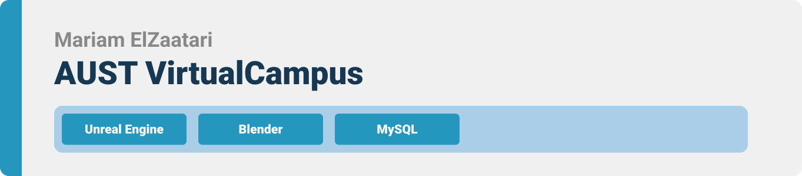
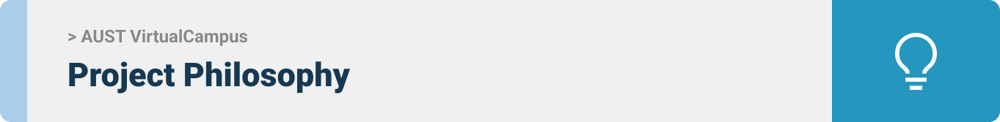
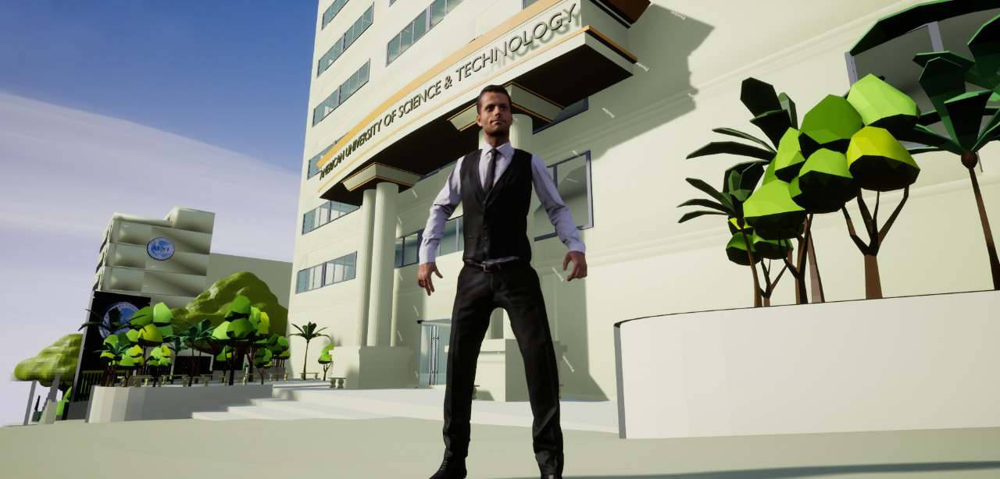
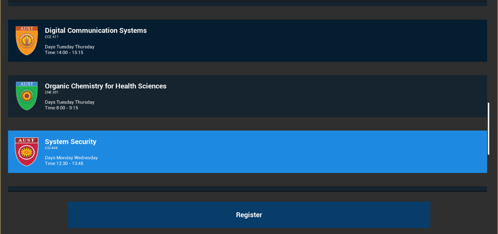

> Hello world! This is the project’s summary that describes the project plain and simple, limited to the space available. 


**[PROJECT PHILOSOPHY](https://github.com/MariamElZaatari/AUSTVirtualCampus#project-philosophy) • [TECH STACK](https://github.com/MariamElZaatari/AUSTVirtualCampus#tech-stack) • [IMPLEMENTATION](https://github.com/MariamElZaatari/AUSTVirtualCampus#implementation)**

  

> The AUST Virtual Campus is an e-learning desktop application that simulates a real campus’ atmosphere, activities, and interactions. 
> 
> The student can attend virtual classes, meetings, and conferences. 
> Moreover, different avatars would be available for each student to match his own preferences. 
>  Lastly, the student can enjoy interacting with other students and joining workgroups.

  

Here's a brief high-level overview of the tech stack the app uses:

- The project is developed in [Unreal Engine™](https://www.unrealengine.com/en-US/) by using the creation tools for game development. Unreal Engine is the world's most open and advanced real-time 3D creation tool for photoreal visuals and immersive experiences.
- It is written mainly in Blueprints and C++™. Blueprints are used throughout the project for a simpler and faster results.
- For persistent storage (database), the app uses the [MySQL](https://www.mysql.com/) package which allows the app to have a structured collection of data.It is a relational database management system that is based on structured query language (SQL).
- All computer graphics are designed on [Blender™](https://www.blender.org/) as a 3D modeling software. Blender is a free and open-source 3D computer graphics software toolset used in major art departments.

  

> Using the above mentioned tech stacks, the implementation of the app is shown as below, these are screenshots and a link to the demo video from the real app.
 
<table border="1" width="100%">
<tr>
  <th colspan=2> <b>Demo Video</b></th>
</tr>
<tr>
  <td width="100%">
 https://drive.google.com/file/d/1hi1p8ZBIGt9Vq2XpdhULmCF7vRo5wq6B/view?usp=sharing 
</td>
</tr>
</table>
 
<table border="1" width="100%">
<tr>
  <th colspan=2> <b>Screenshots</b></th>
</tr>
<tr>
  <td width="100%">
  
</td>
</tr>
<tr>
  <td width="100%">
  
</td>
</tr>
<tr>
  <td width="100%">
  
</td>
</tr>
</table>
